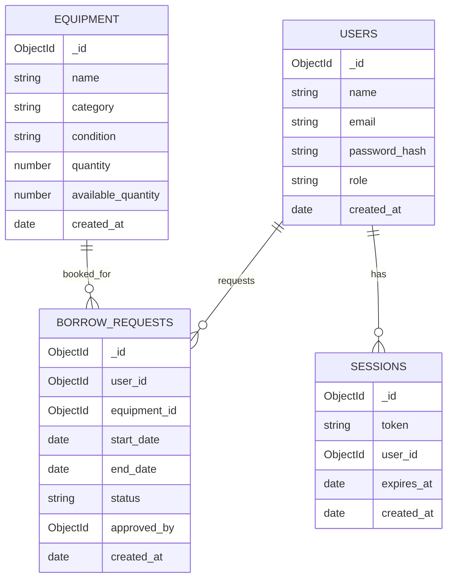

# Equipment Lending Portal - Database Schema

MongoDB collections modeled via Mongoose.

## ER diagram

## Notes
- `users.email` and `sessions.token` are unique.
- `borrow_requests.status` is one of: `pending`, `approved`, `rejected`, `returned`.